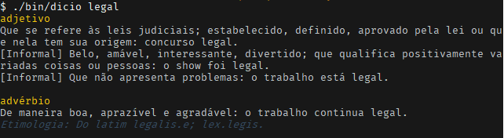

# dicio

> Dicionário de português via linha de comando.

[](https://www.paypal.com/cgi-bin/webscr?cmd=_s-xclick&hosted_button_id=3WZ447WCJ54XG&source=url)

**Obs.:** É necessário estar conectado à internet para usá-lo.

Todos os dados apresentados são extraídos do site [dicio.com.br](https://dicio.com.br).

Essa ferramenta não é oficial do site!

## Instalação

Instale-o como quiser, pode ser como `npm` ou `yarn`:

Veja os comandos:

- npm: `npm install --global dicio`
- yarn: `yarn global add dicio`

## Uso

Depois da instalação você vai ter o comando `dicio` disponível.

Use `dicio --help` para ver o modo de uso.

```
$ dicio --help

  Uso: dicio <palavra> [...opções]

  Opções aceitas:

    --synonyms, -s      Exibe os sinônimos da paalvra.
    --antonyms, -a      Exibe os antônimos da palavra.
    --definition, -d    Exibe a definição da palavra.
    --no-meaning, -m    Não exibe o significado da palavra.
    --no-colors         Não exibe cores.
    --help, -h, -?      Exibe isso.
    --version, -v       Exibe a versão atual.
```

Use somente `dicio` e a palavra que deseja consultar para ver simplesmente o
signficado dela. Não é necessário inserir acentuações na palavra pois elas serão
removidas automaticamente durante a pesquisa.

Caso queira ver mais informações sobre ela, como *sinônimos*, *antônimos* ou
*definição* (como classe gramatical, separação silábica, plural, etc) então
use os comandos:

* `--synonyms` ou `-s` para ver os sinônimos da paalvra.
* `--antonyms` ou `-a` para ver os antônimos da palavra.
* `--definition` ou `-d` para ver a definição da palavra.

A odem de exibição desses itens será de acordo com a chamada deles.

O significado da palavra sempre aparecerá junto às outras informações. No
entanto, caso você não queira exibi-lo, então você poderá usar a opção
`--no-meaning`.

Use a opção `--no-colors` para não exibir cores no terminal, caso elas estejam
sendo um incômodo.

### Exemplo

Um simples exemplo de pesquisa da palavra "legal":



## Contribuição

Os dados apresentados são extraídos diretamente do HTML do site, portanto, há
grandes possibilidades do site atualizar ou sair fora do ar e essa ferramenta
não conseguir fazer a raspagem das informações. Logo, se você estiver obtendo
muitos erros verifique se o site está funcionando e abra uma *issue* aqui.

Sinta-se livre para corrigir qualquer coisa e mandar novas ideias.

## Agradecimentos

Muito obrigado ao [Felipe Nolleto](https://github.com/nolleto) por dar o
pontapé inicial na estilização dos dados extraído presente nessa versão da
ferramenta e a
[todos os contribuidores](https://github.com/theuves/dicio/graphs/contributors)
ao longo das versões anteriores.

## Licença

MIT &copy; [Matheus Alves](https://github.com/theuves)
